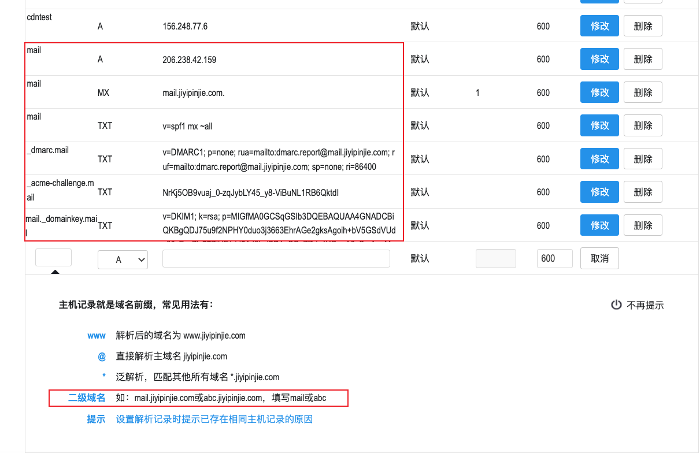

# docker mail server 安裝步驟
##### 參考 
https://www.dropbox.com/scl/fi/4d4vse1tnhhm5b2k1b9j1/Docker-Mailserver.paper?dl=0&rlkey=79ipj4ynhkxfl06gmyqhc5pih

##### git 
https://github.com/docker-mailserver/docker-mailserver

### 步驟說明
#### 1.安裝 docker-compose

#### 2.設定 DNS (domain, TXT, _dmarc, DKIM)  需先申請SSL 證書
##### 參考
_dmarc @{domain} 換成自己的 ,DKIM 之後產生, (二級域名設定要注意)  

#### 3.build docker-compose
docker-compose up -d
建mail server 帳號

##### 產生帳號  @domain password 換成自己的 
##### admin@{domain} {password}
./setup.sh email add admin@mail.jiyipinjie.com Ab123456

##### 收信時轉寄 由 admin@{domain} '要轉入的信箱'
./setup.sh alias add admin@mail.jiyipinjie.com user@gmail.com

##### 產生 DKIM  keysize 1024 domain '自己的domain'
./setup.sh config dkim keysize 1024 domain 'mail.jiyipinjie.com'

##### DKIM path
opt/mail_server/docker-data/dms/config/opendkim/keys/{domain}/mail.txt
回第二步驟 綁定 DKIM

##### 執行說明項目
./setup.sh help